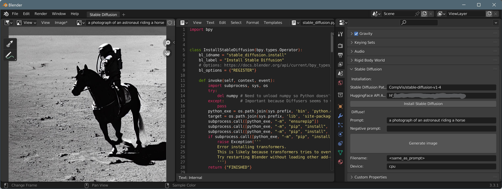

# Stable-Diffusion-for-Blender
# !!! Deprecated in favor of [Dream Textures](https://github.com/carson-katri/dream-textures)
A Blender UI for Stable Diffusion. Everything runs locally on your machine, so all the power of Blender and Stable Diffusion is completely in your hands.

# How is this New?
Blender add-ons that integrate Stable Diffusion already exist. Here are the two most common add-ons I've found and why this script might fill a different niche:
1. [AI-Render](https://github.com/benrugg/AI-Render) is an amazing open-source Blender add-on that harneses most of the power of Stable Diffusion. Inference is done on a remote server. Local installation can be done by also installing that server locally. This project aims to replicate many of AI-Render's while retaining everything locally and with minimal installation work. 
2. [CEB Stable Diffusion](https://carlosedubarreto.gumroad.com/l/ceb_sd) is another powerful Blender add-on that can do everything AI-Render can and more. Inference is done locally, and while I haven't gotten a chance to play around with it yet, it seems intuitive to set up. However, it costs $$$. This project will always remain open-source.

# Important Notes:
1. This is not an add-on yet. For now, it's just a Python script you can copy and paste into a Blender file. I'm looking into converting this into an add-on.
2. This script installs Python packages to the version of Python that is built into Blender. 
3. Therefore, **it will not work for versions of Blender installed through most app stores,** and you might need to change some permissions for Blender versions that were installed through an executable. It works best on 
4. This script has only been tested on Windows 11, running Blender 3.3, extracted from a .zip file.
5. Please don't hesitate to file an issue if you have any trouble using this script.

# Instructions
1. Copy and paste this file into Blender and run it as a script.
2. A dialog appears in the "Scene" section of the Properties editor, usually under "Rigid Body World", titled "Stable Diffusion"
3. Hit the "Install Stable Diffusion" if you haven't already done so.
4. Fill in the `prompt`, `negative_prompt`, and `filename` as desired.
5. Hit "Generate Image" to create the image. 
6. Wait for Stable Diffusion to finish generating an image. Right now, Blender hangs while Stable Diffusion is running, and it can take anywhere from 10 seconds (12th gen i7 with RTX 3080 TI) to 20 minutes (8th gen i7 mobile, cpu only)
7. Enjoy!
